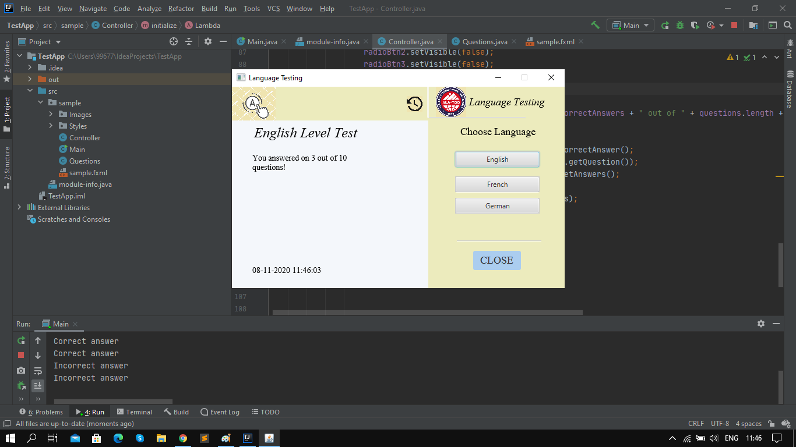

# Project description
It is language level test program, now there is only one language, but i want to add more tests soon. 
My program works simply, just run it and then you need to register in my program only then you nedd login in my programm after that you will able to answer all questions, and get your results, at the end you can just press the button 'Close', and program will authomaticly closed. Done with love.
## Team
Kachykeev Alisher com19
## YouTube
Access to the video only through the [link](https://youtu.be/Ym_KuuS-qD8)
## Images

## File
Here is .jar file: [TestApp.jar]
Here is tutorial
