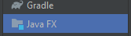
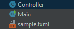
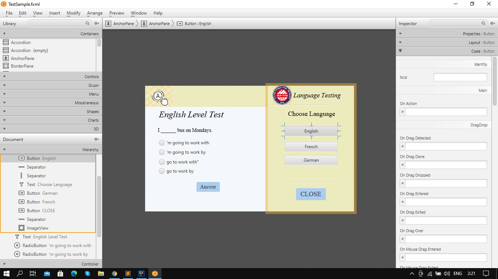
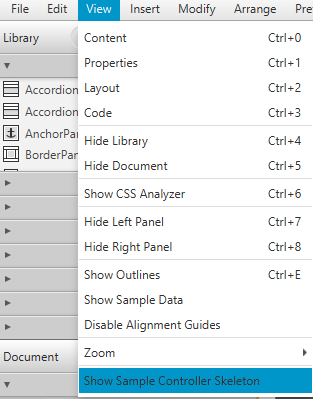
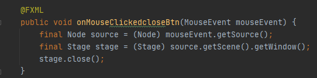
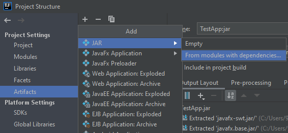

# Tutorial
First of all you should create new file as "JavaFX Application", as shown here

And then you will get 3 files like that

 Main class contains Main method wich runs your programm, also in this class you cange the title, height and width of your project. Contolerr class resposible for funtionality of our application and in this class we can give functions to different buttons that we will make soon. And last file is Sample.fxml, responsible for how our programm looks like, you can write code manually, but i used one programm which makes life easier 'sceneBuilder'.
 
 Here you can come up with your own interface for your project, then you will need identify every button, textfield, and so on. After that you can get the sceletone of this project in menu "View -> show sample controller sceleton" and put this code in Contorller class
 
After that what you should do it is give function on your buttons, for instance "Close button" will close your application. This is done as follows,
 
Last thing it is making .jar file of your project, and than you will able to share your programm with your friends and so on. You should go to the "Project structure" in menu, than "artifacts", than "add Jar, from modules with dependecies..." and thats all, you can do my application

